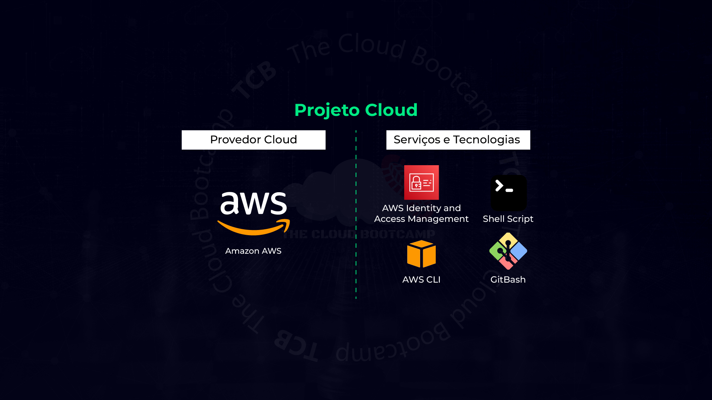

  <h1 align="center">Migração de usuários de forma automatizada e gerenciamento dos recursos do IAM (Identity and Access Management) da AWS</h1>

## Descrição do projeto:
Nesse projeto baseado em um cenário real, tive que atuar como Especialista Cloud para realizar a migração de usuários de forma automatizada e gerenciar os recursos do IAM (Identity and Access Management) da AWS.
 Haviam 100 usuários que precisaram ser migrados e ter o MFA - Autenticação por múltiplos fatores (Multi-factor Authentication) habilitado nas contas, pois esta é uma melhor prática de segurança.
 Para não ser uma tarefa repetitiva e manual na console da AWS, precisei ter o pensamento voltado a automatizar os processos.
 Fazendo uso do GitBash com AWS CLI e Shell Script na IAM da AWS.

Passo 1 - Ajustar a planilha com todos os usuários para que o script possa executá-la.
De:

Para:

Passo 2 -  Instalar as ferramentas necessarias no bash:

Passo 3 - Dar permissão de execução ao script:

Passo 4 - Rodar o script.sh dentro da pasta com o projeto:

Resultado:
Aqui temos alguns dos usuários criados dentro no IAM da AWS com SUCESSO!

